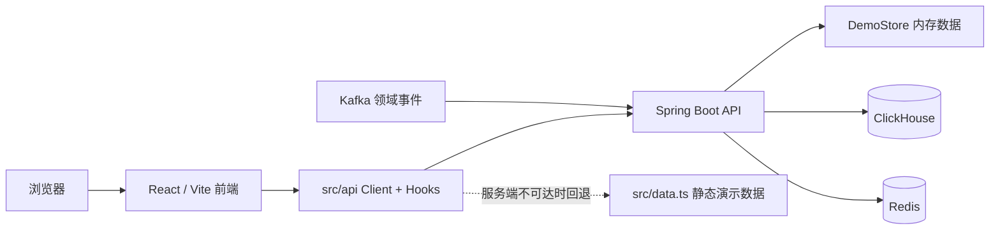

# Monitor · 多业务线订单监控原型

Monitor 是一个**旁路式订单业务监控平台原型**，面向研发值班、运营、客服与风控人员，覆盖司机端、转单端、顺风车、代驾、接送机等业务线。仓库同时包含可交互的 React 前端、Spring Boot 服务端、ClickHouse 表结构以及完整的 API 设计文档。

> 前端已完成与服务端 `/api/v1` 接口的对接（统一 API Client + 数据 Hooks，见 `src/api/`）：启动服务端后各视图自动读取实时接口数据，页面右上角显示「实时接口」徽标；**服务端不可达时自动回退到仓库内静态演示数据**（徽标显示「演示数据」），因此仍可不启动服务端直接浏览原型。服务端提供独立的 `demo` Profile，启动时无需 ClickHouse、Kafka 或 Redis。

## 功能概览

| 视图 | 主要能力 |
| --- | --- |
| 值班哨 | 链路健康、核心 KPI、业务线概览、活动告警与告警认领 |
| 经营大盘 | 订单趋势、履约漏斗、业务构成、城市排行与时段热力图 |
| 履约质量 | 取消原因、等待时长、客诉/申诉与风险城市 |
| 客服工作台 | 根据订单号查看订单快照和完整事件时间线 |
| 风控观测 | 规则命中、冻结金额、异常实体与风险趋势 |
| 接口监控 | 核心接口状态、失败率、P99 延迟、依赖拓扑与慢调用 |
| 指标库 | 指标检索、口径/公式、事件来源、版本及使用位置 |
| 元监控 | 数据管道、消费延迟、对账回补与事件质量 |
| 接口文档 | 11 个接口域、53 个 HTTP/SSE 端点的可搜索交互文档 |

前端内置业务线切换、图表联动、告警详情抽屉、告警认领、订单检索、指标筛选、API 方法筛选和代码复制等交互。

## 技术栈

### 前端

- React 19 + TypeScript 5
- Vite 7
- Tailwind CSS 4 + 自定义响应式样式
- Recharts 3
- Motion for React
- Lucide React
- `vite-plugin-singlefile`（生产构建输出单个 HTML 文件）

### 服务端

- Java 25
- Spring Boot 4.1.1
- ClickHouse JDBC
- Kafka、Redis、Caffeine
- Maven

## 架构与当前状态



开发环境下 `frontend/vite.config.ts` 已将 `/api` 反向代理到 `http://127.0.0.1:8080`（可用环境变量 `MONITOR_API_TARGET` 覆盖），浏览器端只走相对路径 `/api/v1`，不硬编码服务地址。前端接口对接代码集中在：

- `frontend/src/api/client.ts`：统一 API Client、`/api/v1` 端点封装、响应外壳解包、角色 token 与口径水印响应头处理。
- `frontend/src/api/hooks.ts`：`useApi` 数据获取 Hook（loading / error / 轮询 / 自动取消）。
- `src/api/format.ts`：展示层格式化（金额分→元、比率→百分比等）。

各视图刷新策略遵循接口文档 §15：值班哨 20s、告警 30s、经营大盘/履约质量/风控 60s、接口监控拓扑 15s、客服工作台手动查询。

服务端设计遵循三条核心约束：

1. **比率不落库**：聚合层仅保存可加性原子指标，比率在查询期由分子和分母派生。
2. **口径不硬编码**：指标定义、漏斗步骤和阈值统一来自指标字典。
3. **权限即数据源**：不同 Token 角色绑定不同的数据访问范围，维度越权直接返回 `403`。

服务只消费业务领域事件，不回写业务存储。

## 快速开始

### 1. 启动前端原型

环境要求：

- Node.js `>= 20.19`（推荐使用 Node.js 22 LTS）
- npm `>= 10`

```bash
# 进入前端目录（前端与后端分列为仓库一级子目录）
cd frontend

# 安装锁文件中声明的依赖
npm ci

# 启动开发服务器
npm run dev
```

浏览器访问 <http://localhost:5173>。开发模式支持热更新，体验前端页面**不要求启动服务端**。

如需允许局域网或容器外访问：

```bash
npm run dev -- --host 0.0.0.0
```

### 2. 构建前端

```bash
npm run build
```

构建结果位于 `dist/index.html`。项目启用了单文件插件，脚本与样式会内联到该 HTML 中，便于直接交付静态页面。

本地预览生产构建：

```bash
npm run preview -- --host 0.0.0.0
```

### 3. 启动服务端 Demo（可选）

服务端需要：

- JDK 25
- Maven 3.9+

仓库当前未包含 Maven Wrapper，请使用本机的 `mvn`：

```bash
cd backend
mvn spring-boot:run -Dspring-boot.run.profiles=demo
```

Demo 模式监听 <http://localhost:8080>，使用内存 `DemoStore`，不依赖 ClickHouse、Kafka 或 Redis。

验证服务：

```bash
# 健康检查
curl http://localhost:8080/actuator/health

# 值班哨首屏数据
curl -s http://localhost:8080/api/v1/sentinel/bootstrap \
  -H "Authorization: Bearer dash-token"

# 演示订单事件时间线
curl -s http://localhost:8080/api/v1/orders/CP20260903018462/events \
  -H "Authorization: Bearer cs-token"
```

Demo Token：

| Token | 角色 | 用途 |
| --- | --- | --- |
| `dash-token` | `DASH_READ` | 大盘及聚合指标只读 |
| `cs-token` | `CS_DETAIL` | 客服订单明细 |
| `oncall-token` | `ALERT_OPS` | 告警查询与处置 |
| `ingest-token` | `INGEST` | 事件上报 |
| `admin-token` | `ADMIN` | 字典、规则及管理操作 |

> Token 仅用于本地演示。生产环境应接入 SSO 并换取短时效用户 Token。

### 4. 使用预构建 Docker 开发镜像

如果机器已安装 Docker，可以完全跳过宿主机的 JDK、Maven 和后端依赖安装。开发镜像内置 JDK 25、Maven 3.9.12，并预热 Demo 与生产集成所需的 Maven 依赖。

```bash
# 拉取由 GitHub Actions 发布到 GHCR 的镜像
docker pull ghcr.io/ivanmissu/monitor-order-monitoring-prototype-backend-dev:java25

# 直接启动镜像中对应提交的 Demo 服务
docker run --rm -p 8080:8080 \
  ghcr.io/ivanmissu/monitor-order-monitoring-prototype-backend-dev:java25
```

也可以从当前代码构建并通过 Compose 启动：

```bash
docker compose -f compose.backend.yml up --build
```

镜像启动后访问 <http://localhost:8080>，健康检查仍为 <http://localhost:8080/actuator/health>。如果 GHCR Package 保持私有，需要先使用具备 `read:packages` 权限的 GitHub 凭据执行 `docker login ghcr.io`；也可以在 Package 设置中将其改为 Public，后续即可匿名拉取。

镜像由 `.github/workflows/backend-dev-image.yml` 自动构建并进行健康检查、值班哨和订单事件 API 冒烟测试。固定版本可使用工作流生成的 `sha-<commit>` 标签，`java25` 标签始终指向最近一次成功构建。

> Docker 镜像存放在远程 GHCR 才能跨机器或新 Session 复用；仅存在于本机 Docker daemon 的镜像不会随临时环境自动保留。

### 5. 在 Arena 沙箱启动服务端

Arena 沙箱没有 JDK/Maven/Docker，出网也受限。这里的方案是：**编译打包走 GitHub Actions（Temurin JDK 25），产物经专用 git 分支带回沙箱，再用 PyPI 的 `jdk4py`（Java 25 运行时）启动 jar**。

```bash
bash scripts/arena-run-backend.sh
```

一步到位：安装 `jdk4py==25.0.2.1` → 触发/等待 CI 构建 → 用 git 取回 jar → 绑定 `0.0.0.0:8080` 启动。完整原理与手动分步、排障见 [Arena 后端启动手册](docs/arena-backend-runbook.md)。

## 生产模式服务端

生产 Profile 默认连接 ClickHouse，并可使用 Kafka 和 Redis。启动前先创建 ClickHouse 表：

```bash
cd backend
clickhouse-client --multiquery < src/main/resources/db/clickhouse-ddl.sql

export CH_DASH_PWD='<聚合查询账号密码>'
export CH_CS_PWD='<明细查询账号密码>'
export MONITOR_KAFKA='mq-01:9092,mq-02:9092'
export MONITOR_REDIS='redis://127.0.0.1:6379'

mvn spring-boot:run
```

数据源地址、查询资源限制、告警周期等配置位于 `backend/src/main/resources/application.yml`。部署前请按实际环境修改 ClickHouse 地址和账号策略，不要将密码提交到仓库。

## 常用命令

| 命令 | 说明 |
| --- | --- |
| `npm run dev` | 启动 Vite 开发服务器 |
| `npm run build` | 执行 TypeScript/Vite 生产构建 |
| `npm run preview` | 预览生产构建 |
| `mvn spring-boot:run -Dspring-boot.run.profiles=demo` | 启动无中间件依赖的服务端 Demo |
| `mvn test` | 运行服务端测试 |
| `mvn package` | 打包服务端 |

## 目录结构

```text
.
├── frontend/                  # React 前端（Vite）
│   ├── src/
│   │   ├── App.tsx             # 主应用及 8 个监控视图
│   │   ├── ApiDocs.tsx         # 交互式 API 文档页
│   │   ├── MetricLibrary.tsx   # 指标库与集成样例
│   │   ├── data.ts             # 前端大盘静态演示数据
│   │   ├── metrics-data.ts     # 指标字典演示数据
│   │   ├── api-doc-data.ts     # API 文档数据
│   │   ├── api/                # 统一 API Client 与数据 Hooks
│   │   └── index.css           # 全局、响应式及组件样式
│   ├── index.html
│   ├── vite.config.ts          # /api 反向代理等开发服务器配置
│   ├── package.json
│   └── tsconfig.json
├── backend/
│   ├── src/main/java/          # Spring Boot 服务端实现
│   ├── src/main/resources/     # 配置与 ClickHouse DDL
│   ├── pom.xml                 # Maven 配置
│   └── README.md               # 服务端实现说明
├── docs/
│   └── monitor-api.md          # 完整 API 设计文档
├── scripts/                    # 沙箱/CI 辅助脚本
└── compose.backend.yml         # 后端开发镜像编排
```

## 数据与二次开发

- 修改大盘、告警、订单时间线等演示数据：`src/data.ts`
- 修改指标库内容：`src/metrics-data.ts`
- 修改页面内 API 文档：`src/api-doc-data.ts`
- 修改完整 Markdown 接口设计：`docs/monitor-api.md`
- 修改服务端 Demo 数据：`backend/src/main/java/com/monitor/server/store/DemoStore.java`
- 修改鉴权 Token 或基础设施连接：`backend/src/main/resources/application.yml`

若要将前端接入服务端，建议先增加统一 API Client，并将当前静态数据逐步替换为 `/api/v1` 请求；开发环境可在 `frontend/vite.config.ts` 中配置 `/api` 反向代理，以避免跨域和浏览器端硬编码服务地址。

## 相关文档

- [服务端实现说明](backend/README.md)
- [完整 API 设计文档](docs/monitor-api.md)
- 前端启动后可从侧边栏进入“接口文档”查看可搜索版本

## 常见问题

### Vite 提示 Node.js 版本过低

升级到 Node.js 20.19+ 或 Node.js 22.12+，删除本地 `node_modules` 后重新执行 `npm ci`。

### 页面可以打开，但看不到真实接口数据

这是当前原型的预期行为：前端默认读取静态数据，尚未请求 Spring Boot 服务。启动服务端不会自动改变前端数据源。

### 字体加载失败

页面会尝试加载 Google Fonts；网络不可用时会自动回退到苹方、微软雅黑及系统字体，不影响核心功能。

## License

本项目基于 [Apache License 2.0](LICENSE) 开源。
