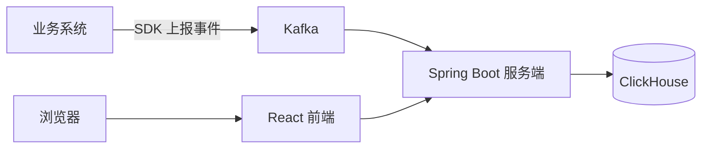
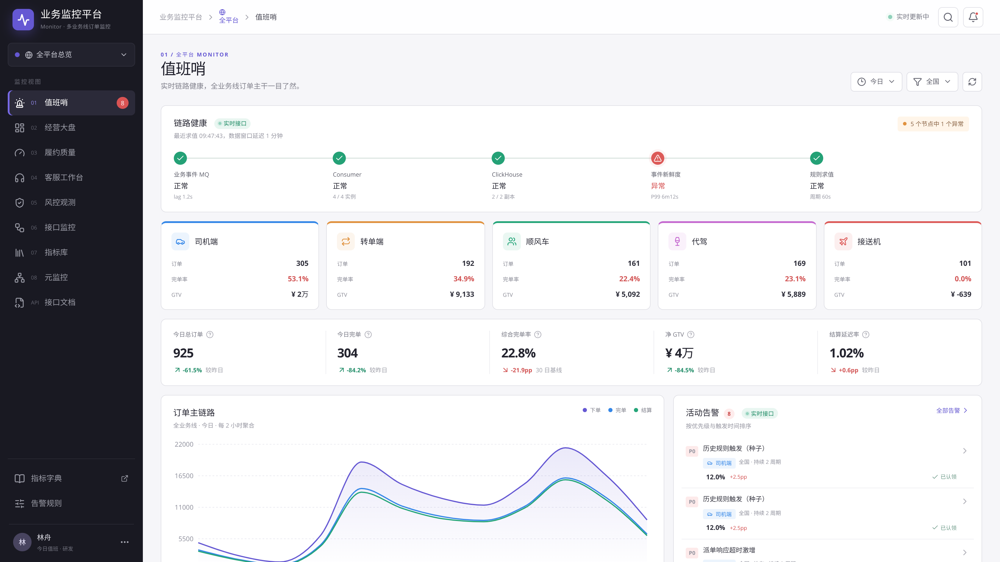
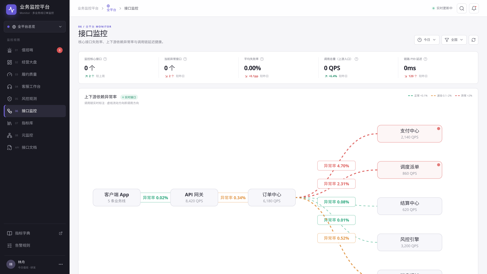

# Monitor · 多业务线订单监控平台

**旁路式订单业务监控平台**：只消费业务领域事件，把订单在各业务线里发生的事聚合成可观测的
指标、看板与告警，**不回写业务存储、不参与业务链路**。

覆盖司机端、转单端、顺风车、代驾、接送机，服务研发值班、运营、客服与风控。
仓库包含可交互的 React 前端、Spring Boot 服务端、ClickHouse 表结构、上报 SDK 与完整文档。



## 界面预览

| 值班哨：实时链路健康 × 活动告警 | 接口监控：上下游依赖异常率拓扑 |
| --- | --- |
| [](docs/assets/screenshots/view-sentinel.png) | [](docs/assets/screenshots/view-tech.png) |

---

## 快速开始

### 只看前端（最快，不需要服务端）

```bash
cd frontend
npm ci
npm run dev
```

打开 <http://localhost:5173>。服务端不可达时页面自动回退到内置演示数据，
右上角徽标会显示「演示数据」而非「实时接口」。

> 需要 Node.js ≥ 20.19（推荐 22 LTS）。

### 加上服务端（Demo 模式，无需中间件）

```bash
cd backend
mvn spring-boot:run -Dspring-boot.run.profiles=demo
```

服务监听 <http://localhost:8080>，使用内存数据，不依赖 ClickHouse / Kafka / Redis。
前端开发服务器已把 `/api` 代理到 `127.0.0.1:8080`，刷新页面徽标即变为「实时接口」。

验证：

```bash
curl http://localhost:8080/actuator/health
curl -s http://localhost:8080/api/v1/sentinel/bootstrap -H "Authorization: Bearer dash-token"
```

演示 Token：`dash-token`(大盘只读) · `cs-token`(客服明细) · `oncall-token`(告警处置) ·
`ingest-token`(事件上报) · `admin-token`(管理)。

> ⚠️ 这些 Token 是**硬编码明文**，仅供本地演示。生产必须接 SSO 换短时效用户态 Token。

### 部署到 Kubernetes

完整生产形态（前端 + 后端 + ClickHouse + Kafka + Redis）见
**[K8s 部署手册](docs/ops/k8s-deployment.md)**，配套清单在 [`deploy/`](deploy/)，可直接 `kubectl apply`。

---

## 文档

**👉 完整索引见 [`docs/README.md`](docs/README.md)**

| 我想… | 看这篇 |
| --- | --- |
| 了解产品定位与九个视图 | [产品概览](docs/product/overview.md) · [视图详解](docs/product/views.md) |
| 搞清楚系统怎么设计的 | [技术架构](docs/tech/architecture.md) |
| 对接接口 | [API 参考](docs/tech/api-reference.md) |
| 把业务事件报上来 | [SDK 接入手册](sdk/README.md) |
| 部署上线 | [K8s 部署手册](docs/ops/k8s-deployment.md) |

---

## 仓库结构

```text
.
├── frontend/              React 19 + Vite 7 前端
├── backend/               Spring Boot 4 服务端（Java 25）
├── sdk/                   指标事件上报 SDK（Core / Starter / Java Agent）
├── business-system-demo/  集成 SDK 的订单业务系统示例
├── deploy/                K8s 清单与生产镜像 Dockerfile
├── docs/                  产品 / 技术 / 运维文档
└── scripts/               沙箱与 CI 辅助脚本
```

## 技术栈

**前端** React 19 · TypeScript 5 · Vite 7 · Tailwind CSS 4 · Recharts 3
**服务端** Java 25（虚拟线程）· Spring Boot 4.1 · Maven
**存储与中间件** ClickHouse · Kafka · Redis · Caffeine

## 常用命令

| 命令 | 说明 |
| --- | --- |
| `npm run dev` | 启动 Vite 开发服务器 |
| `npm run build` | 类型检查 + 生产构建 |
| `mvn spring-boot:run -Dspring-boot.run.profiles=demo` | 启动无中间件依赖的服务端 |
| `mvn -P integration-bundle package` | 打包服务端（生产镜像用此 profile，[原因](docs/tech/architecture.md#9-已知限制)） |

## License

[Apache License 2.0](LICENSE)
