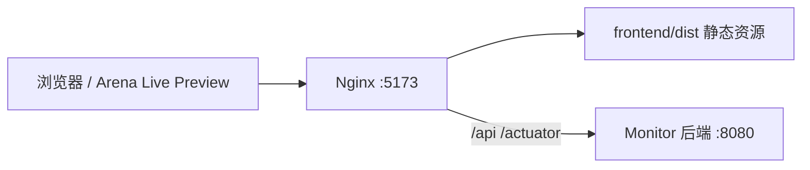

# Arena 前端正式启动手册（生产构建 + Nginx）

> 面向 Arena Agent 的可复用前端启动手册。用户说「按正式启动效果看前端」时，按本文档执行：先 `npm run build` 生成 `frontend/dist`，再用 Nginx 托管静态资源，并由 Nginx 反向代理 `/api` 到后端。

## 启动形态

与 `npm run dev` 不同，本方式验证的是更接近线上部署的形态：



- 前端静态文件来自 `frontend/dist`，由 `npm run build` 生成。
- Nginx 监听 `0.0.0.0:5173`，便于 Arena 预览代理访问。
- 浏览器端仍只访问相对路径 `/api/v1`，Nginx 将 `/api` 代理到 `http://127.0.0.1:8080`。
- React SPA 路由通过 `try_files $uri $uri/ /index.html` 回落到入口文件。
- 静态资源 `/assets/*` 设置长缓存，并返回 `X-Frontend-Mode: production-nginx`，便于确认当前不是 Vite dev server。

## 一键启动脚本

仓库提供脚本：

```bash
bash scripts/arena-run-frontend-nginx.sh
```

脚本会自动完成：

1. 检查是否存在系统 `nginx`。
2. 若 Arena 沙箱没有 Nginx，则从 GitHub 源码编译轻量 Nginx 到 `/tmp/nginx-monitor-prod`。
3. 如缺少 `node_modules`，执行 `npm ci`。
4. 执行 `npm run build` 生成 `frontend/dist`。
5. 写入 Nginx 配置并前台启动 Nginx。

> Arena 沙箱通常没有 `nginx`，且 `apt-get` 无法访问 Debian 源；脚本会走 GitHub 源码编译，避免依赖系统包管理器。

复用已有构建产物、跳过前端打包：

```bash
bash scripts/arena-run-frontend-nginx.sh --no-build
```

强制重新安装前端依赖后再构建：

```bash
bash scripts/arena-run-frontend-nginx.sh --npm-ci
```

## 推荐完整启动顺序

### 1. 先启动后端

正式联调建议使用 integration 全链路后端：

```bash
bash scripts/arena-run-integration.sh --no-build
```

如果只需要无中间件 demo 后端，也可以：

```bash
bash scripts/arena-run-backend.sh --no-build
```

后端应监听 `0.0.0.0:8080`，健康检查：

```bash
curl -s http://127.0.0.1:8080/actuator/health
```

期望看到：

```json
{"status":"UP"}
```

### 2. 再启动 Nginx 生产前端

在另一个进程中运行：

```bash
bash scripts/arena-run-frontend-nginx.sh
```

脚本默认监听 `5173` 并代理到 `http://127.0.0.1:8080`。

可通过环境变量覆盖：

```bash
PORT=8088 BACKEND_TARGET=http://127.0.0.1:8080 \
  bash scripts/arena-run-frontend-nginx.sh
```

## Arena Agent 操作提示

在 Arena Agent Mode 里，后端和前端都应使用后台进程工具启动，这样会自动生成 Live Preview：

```text
后端进程：bash scripts/arena-run-integration.sh --no-build
前端进程：bash scripts/arena-run-frontend-nginx.sh
```

如之前已经启动过 `npm run dev`，需要先停止 Vite dev server，避免 `5173` 端口冲突；或者给 Nginx 指定其他端口：

```bash
PORT=8088 bash scripts/arena-run-frontend-nginx.sh
```

## 验证正式启动效果

确认首页由 Nginx 返回：

```bash
curl -I http://127.0.0.1:5173/
```

期望响应头包含：

```text
Server: nginx/...
X-Frontend-Mode: production-nginx
```

确认 Nginx `/api` 代理正常：

```bash
curl -s 'http://127.0.0.1:5173/api/v1/sentinel/bootstrap?_monitor_role=dash' | head -c 300
```

期望看到接口外壳：

```json
{"code":0,"message":"OK", ...}
```

如果页面右上角显示「实时接口」，说明生产构建前端已经通过 Nginx 连到真实后端。

## 本地演示鉴权说明

前端演示态会携带静态 Bearer token，同时追加 `_monitor_role` 查询参数。Arena 预览代理有时会剥离浏览器请求里的 `Authorization` 头，因此脚本生成的 Nginx 配置会按 `_monitor_role` 在 Nginx 侧还原演示 token：

| `_monitor_role` | 注入 Token | 角色 |
| --- | --- | --- |
| `dash` | `Bearer dash-token` | 大盘及聚合只读 |
| `cs` | `Bearer cs-token` | 客服订单明细 |
| `oncall` | `Bearer oncall-token` | 告警查询与处置 |
| `ingest` | `Bearer ingest-token` | 事件上报 |
| `admin` | `Bearer admin-token` | 字典、规则及管理操作 |

这只用于本地/Arena 演示。生产环境应由网关或 SSO 注入真实短时效用户 Token。

## 常见问题

### 端口 5173 被占用

通常是之前的 Vite dev server 或旧 Nginx 进程还在运行。停止旧前端进程后重试，或临时改端口：

```bash
PORT=8088 bash scripts/arena-run-frontend-nginx.sh
```

### Nginx 未安装

无需手动安装。Arena 沙箱通常无法 `apt-get install nginx`，脚本会自动从 GitHub 编译并安装到 `/tmp/nginx-monitor-prod`。

### 页面打开但显示演示数据

说明前端没有连到后端真实接口。检查：

```bash
curl -s http://127.0.0.1:8080/actuator/health
curl -s 'http://127.0.0.1:5173/api/v1/sentinel/bootstrap?_monitor_role=dash' | head -c 300
```

如果后端不是 `8080`，用 `BACKEND_TARGET` 指定：

```bash
BACKEND_TARGET=http://127.0.0.1:18080 bash scripts/arena-run-frontend-nginx.sh
```
