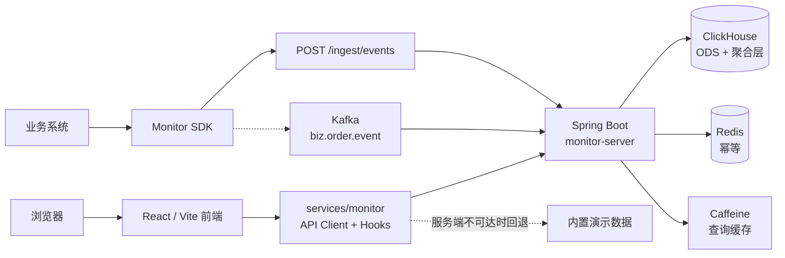

# 技术架构

> 面向研发：系统怎么分层、数据怎么流动、关键设计为什么这么做。
> 接口级细节见 [API 参考](./api-reference.md)，部署见 [K8s 部署手册](../ops/k8s-deployment.md)。

---

## 1. 整体架构



**旁路式**：Monitor 只消费业务领域事件，不回写业务存储、不参与业务链路。
两边互不影响 —— 这是整个架构最重要的前提。

---

## 2. 技术栈

| 层 | 技术 |
| --- | --- |
| 前端 | React 19 · TypeScript 5 · Vite 7 · Tailwind CSS 4 · Recharts 3 · Motion · Lucide |
| 服务端 | Java 25（虚拟线程）· Spring Boot 4.1 · Maven |
| 存储 | ClickHouse（ODS 明细 + 物化视图上卷聚合） |
| 中间件 | Kafka（领域事件）· Redis（幂等）· Caffeine（进程内查询缓存） |
| SDK | 零第三方运行时依赖的 Core + Spring Boot Starter + Java Agent |

服务端读侧多为 IO 等待（ClickHouse / Redis），因此开启 Java 25 虚拟线程
（`spring.threads.virtual.enabled=true`）提升并发密度。

---

## 3. 三条核心约束的实现

产品层面的三条原则（见[产品概览](../product/overview.md#三条产品原则)）在代码里是这样落地的：

### 3.1 比率不落库 → 派生比率引擎

聚合表只存**可加性原子指标**。`AggQueryService#value` 读字典里的
`numeratorSql` / `denominatorSql`，对聚合表发两次原子查询后相除。

收益：

- 比率天然可**同屏返回分子分母**，用户能看到「95% 是 1900/2000 还是 19/20」；
- 口径变更只需 `PUT /dict/metrics/{id}` 登记新版本，**无需回刷历史数据**；
- 告警阈值改动不触碰数据管道。

**例外**：唯一数与分位数无法简单相加，以**可合并状态列**入表
（`uniqCombinedState` / `quantilesTDigestState`），查询时再 merge —— 结果依然精确。

### 3.2 口径不硬编码 → 指标字典

指标定义、漏斗步骤、告警阈值统一来自 `dict/` 包（当前由 `DictSeed` 提供内置基线，
接口与缓存已就绪，可切换为 MySQL `dict_metric` 表加载）。指标库视图就是这份字典的界面。

### 3.3 权限即数据源 → 双数据源 + 行策略

`StoreConfig` 装配两个独立的 HikariCP 数据源，对应两个 ClickHouse 账号：

| 数据源 | 账号 | 连接数 | 超时 | 内存上限 | 可访问 |
| --- | --- | --- | --- | --- | --- |
| `aggDataSource` | `grafana_dash` | 16 | 10s | 2 GB | 聚合表、告警表、系统表 |
| `odsDataSource` | `cs_detail` | 4 | 60s | 6 GB | ODS 明细表 |

这同时解决了两件事：**越权从数据库层面就查不到**（不是应用层过滤），
以及**资源隔离** —— 客服的明细慢查询占不满大盘查询的配额。

> 各账号在运行期实际需要的完整授权清单，见
> [K8s 部署手册 §0③](../ops/k8s-deployment.md#-clickhouse-账号授权不能照抄-ddl)。
> 注意仓库 DDL 末尾的 GRANT 比实际用量窄，不能照抄。

---

## 4. 数据链路

```text
业务系统 ──SDK──> Kafka(biz.order.event) ──> EventConsumer(批量, 手动提交位点)
                                                    │
                                              EventValidator
                                        （枚举校验 / 必填维度 / PII 检测）
                                            ├─ 通过 ──> ods_order_event
                                            └─ 不通过 ─> ods_dirty_event（死信）
                                                    │
                                          物化视图链自动上卷
                                    ods ──> agg_1m / agg_5m ──> agg_1h ──> agg_1d
```

**分层与保留期**：

| 表 | 内容 | 保留 |
| --- | --- | --- |
| `ods_order_event` | 事件明细，真相之源 | 180 天 |
| `ods_dirty_event` | 校验不通过的死信 | 30 天 |
| `agg_1m` | 分钟级，仅主干列，服务告警 | 30 天 |
| `agg_5m` | 五分钟级，全量维度 | 180 天 |
| `agg_1h` | 小时级 | 2 年 |
| `agg_1d` | 日级 | 5 年 |

TTL 写在 DDL 里由 ClickHouse 自动清理，无需运维介入。

**表引擎**：ODS 用 `ReplicatedReplacingMergeTree(version)`（幂等兜底），
聚合层用 `ReplicatedAggregatingMergeTree`，均为 1 分片 × 2 副本。

---

## 5. 幂等三道防线

事件投递是**至少一次**语义，重复必然发生，靠三层防重：

| # | 位置 | 实现 | 作用 |
| --- | --- | --- | --- |
| 1 | `IdempotencyGuard` | Redis `SETNX event_id`，TTL 48h | 第一道，拦掉绝大部分重复 |
| 2 | ClickHouse | `ReplacingMergeTree(version)` | 兜底，Redis 失效也不会重复计数 |
| 3 | `ScheduledJobs#reconcileAndBackfill` | T+1 重算小时/日表 | 迟到事件与修正事件的最终一致 |

Redis 不可用时 `IdempotencyGuard` 退化为进程内 Map，服务仍可启动 ——
丢的只是去重效率，正确性由第 2 层保证。

---

## 6. 告警链路

```text
RuleEvaluator（@Scheduled 60s）
  → RuleRegistry 启用规则（首批 21 条）
  → AggQueryService 求值
  → 小样本门槛：维度 × 分钟事件数 < 20 不评，落小时粒度
  → 持续 N 周期判定（streak 计数，滤毛刺）
  → NoiseReducer 降噪四板斧
  → store.save + AlertEventBus(SSE) + NotifyService(IM 卡片)
```

**降噪四板斧**：

| 板斧 | 规则 |
| --- | --- |
| 去重 | 同规则同维度，恢复前不重复发 |
| 聚合 | 多城并发合成一条摘要，带 TOP 维度 |
| 抑制 | 链路断流压制全部业务告警；上游指标异常压制派生指标告警 |
| 静默 | 发布窗口、T+1 回补期；但 P0 断流类规则（R01/R03/R04）禁止静默 |

**告警必须可行动**：`NotifyService` 生成的卡片强制包含三个链接
（下钻 / 口径说明 / 处置手册 runbook）。不可行动的信号降级进大盘，不发告警。

**小样本门槛**存在的原因：小城市某分钟只有 3 单，取消 1 单就是 33% 取消率 ——
不加门槛会被小基数噪声淹没。

---

## 7. 口径水印

`RequestContext` 在查询链路中收集新鲜度、partial 状态与实际生效粒度，
由 Filter 统一写入响应头，**所有端点自动携带**，Controller 无需关心：

| 响应头 | 含义 |
| --- | --- |
| `X-Monitor-Freshness` | 本结果覆盖的最新事件时间 |
| `X-Monitor-partial` | `true` = 当天分母仍在滚动，前端打「滚动值」标记 |
| `X-Monitor-Grain` | 实际生效粒度（小样本自动降级时返回降级后的值） |
| `X-Monitor-Dict-Version` | 指标字典版本 |

---

## 8. 代码结构

### 服务端 `backend/src/main/java/com/monitor/server/`

```text
├── MonitorApplication      启动类（虚拟线程 + 定时任务）
├── common/                 响应外壳、错误码、请求上下文与口径水印、幂等防线
├── security/               Bearer token → 角色 → 行策略
├── domain/                 BizLine / Grain / TimeRange / Dims
├── dict/                   指标字典（口径唯一真源）+ 事件契约 + 漏斗定义
├── query/                  Metrics 模型 + AggQueryService（派生比率引擎）
├── store/                  MonitorStore 契约 · ClickHouseStore · DemoStore（内存）
├── service/                Sentinel / Dashboard / Alert / Ingest 业务编排
├── alert/                  规则注册表 · 求值器 · 降噪 · SSE 总线 · IM 出站
├── ingest/                 事件信封 + 质量校验（白名单 / PII / 枚举）
├── api/                    11 个接口域的 Controller
├── engine/                 Kafka 消费者 · 逾期扫描 · T+1 对账回补
└── integration/            integration profile 专用（内嵌 Kafka + 种子数据）
```

### 前端 `frontend/src/`

```text
├── app/                    应用装配、布局与导航配置
├── entities/               业务线等领域模型
├── features/               monitoring / metrics / api-docs 功能模块
├── services/monitor/       统一 API Client、useApi Hook、格式化
├── shared/                 通用 UI 与工具
└── styles/                 全局样式
```

前端通过 `services/monitor` 统一接入 `/api/v1`。新增视图请复用统一 API Client 与 `useApi`，
只在服务端不可达时使用模块内 mock 数据兜底。

### 运行 Profile

| Profile | 用途 | 依赖 |
| --- | --- | --- |
| （默认） | 生产 | ClickHouse + Kafka + Redis |
| `demo` | 快速演示 / 前端联调 | 无，内存 `DemoStore` |
| `integration` | 全链路自验 | 真实 ClickHouse/Redis + **进程内嵌** KRaft Kafka |

> ⚠️ `integration` profile 会在进程内起 Kafka 并灌入 14 天种子数据，**不要用于生产**。

---

## 9. 已知限制

| 项目 | 现状 | 影响 |
| --- | --- | --- |
| 鉴权 | 演示态静态明文 Token | 上生产前必须接 SSO |
| 后端水平扩展 | 单副本 | `@Scheduled` 无分布式选主、SSE 总线为进程内，多副本会重复告警。详见 [K8s 部署 §9](../ops/k8s-deployment.md#9-扩容与高可用) |
| 默认 Maven 构建 | 编译不过 | `IntegrationConfig` 依赖 `spring-kafka-test`，需 `-P integration-bundle`。详见 [K8s 部署 §0①](../ops/k8s-deployment.md#-后端镜像必须用--p-integration-bundle-构建) |
| Prometheus 指标 | 未注册 | `pom.xml` 缺 `micrometer-registry-prometheus` |
| IM 通知 | 未实现出站 | `NotifyService#dispatch` 的 HTTP 调用待补 |
| 逾期扫描 | 返回空 | `ScheduledJobs#detectOverdue` 的反连接 SQL 已在注释中给出 |
| 指标字典 | 内置基线 | MySQL `dict_metric` 表加载待接 |

---

## 相关文档

- [API 参考](./api-reference.md) — 55 端点 / 11 接口域的完整契约
- [服务端实现说明](../../backend/README.md) — 包级实现细节
- [前端工程说明](../../frontend/README.md) — 前端目录与开发约定
- [SDK 接入手册](../../sdk/README.md) — 事件上报三种接入方式
- [K8s 部署手册](../ops/k8s-deployment.md) — 生产部署
